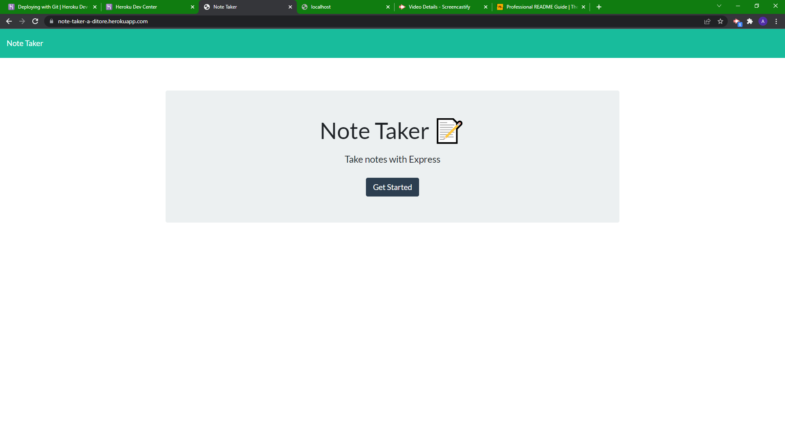

# noteTaker

## Description

This is a note taker application created by me to help someone organize their thoughts and notes.
This application was built to work on understanding back-end server code.
I learned how to add to a JSON database and how to delete from it while also rendering front-end code to a website using express.

## Table of Contents

- [Description](#description)
- [Installation](#installation)
- [Usage](#usage)
- [Links](#links)

## Installation

Requires npm Express

## Usage

Click on the image to go to a video of the application

[](https://drive.google.com/file/d/1w45j7w8SH3-jGwDZjYBTiOZ_aHXwqtU0/view)

```
GIVEN a note-taking application
WHEN I open the Note Taker
THEN I am presented with a landing page with a link to a notes page
WHEN I click on the link to the notes page
THEN I am presented with a page with existing notes listed in the left-hand column, plus empty fields to enter a new note title and the note’s text in the right-hand column
WHEN I enter a new note title and the note’s text
THEN a Save icon appears in the navigation at the top of the page
WHEN I click on the Save icon
THEN the new note I have entered is saved and appears in the left-hand column with the other existing notes
WHEN I click on an existing note in the list in the left-hand column
THEN that note appears in the right-hand column
WHEN I click on the Write icon in the navigation at the top of the page
THEN I am presented with empty fields to enter a new note title and the note’s text in the right-hand column
```

## Links

Link to deployed heroku app

https://note-taker-a-ditore.herokuapp.com/
